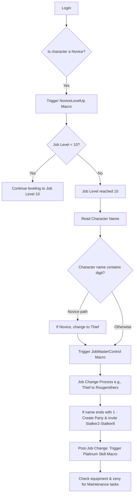

# Asgards Glory Botting & Openkore Automation

[![Openkore](https://img.shields.io/badge/OpenKore-3D548F?style=for-the-badge&logo=data:image/png;base64,iVBORw0KGgoAAAANSUhEUgAAALgAAACTCAYAAAA9WNMyAAAZyUlEQVR4nO2deXRURfbHvzRrkOwLEbKzmAVIJwghEAjEmEAIOwkQAwERWUac6PzOiIo/cHBG/Q0KiAoICDguoM4YAUfccAQFRYGABAYQCCRAIEAWNgOB+/ujOhpCuvstVe91N+9zzj2cE96791a9+6qr6lXdakJEcBGaA2gLwB+AF4CmADws/94EUAXgBoBKAOUAzgH4VQc/DTSkmd4OKMAfQE8A3QDEAggB0N4iTWXqOg+gGMAvAPYA2AtgH4DjnHw10JkmTtCCdwQwEEASADOAezSweQ7ANgBfANgE9gIYOCGOGuAxAMYAyIY2AW2PgwDeBwv2HQBq9XXHQCqOFOAdAIyySE+dfbHFaQBrAKwAcERnXwzs4AgBngTgTwCGAjDp7IscbgJYD+AlAN/q7IuBFfQM8BYAJgOYBTZQdFZOAHgRwCoAV3X2xaABegS4CUAugL8ACNXauEAuAlgO4DkAFTr7YmBBywA3AZgK52+x7XEOwP8CWAbWjTHQEa0CvAvYoCxBC2MOwg8ApgD4WW9H7mRED+pMAJ4EsBN3VnADrLw/AVgK9oXVQAdEtuBBAN4B0E+UASfiLICJAD7V2Y87DlEteCaALTCCu44AABvA6sVAQ0QEeB6ADwCEC9DtzDQFq5c8vR25k+AZ4E0AzAOwGkArjnpdiVZg9TMPrL4MBMOrD94UwEoYrZMc1oDNslzX2xFXhkeAtwAbTI5W784dx89ga28O6+2Iq6I2wFsAWAdgOBdv7kxOgQ3GjYVbAlAT4MFgi43M3LwRx0049kKuYrAgL9HZD5dDzUN/C84R3CfB1pcX6OyHLcLA6tOAM0oDfBaA/hz9EMkGAP8FMAJAJNhiqGO6etQ4/cHq1YAjSrooIwB8CMf+ya9PEoDvGvl7FwBDwFY2RmvqkXVugg3WP9LbEVdBboBHgm3ZchfjDnd2Aegu4bp4sEAfByBQqEf2uQhgMICtOvvhEsgJ8FYAfgRr+ZyF+wF8KeN6E9h2uUwAD4D1jfWgBix7wEWd7LsMcgL8FQAzBfrCmz1QPwhOAjAeQBYAb7UOyWQHgPsAXNLYrkshtR+dBucKbgB4m4OOb8E2adwNYCTYZ/YzHPRKoSeAlzWy5bJIbcF3AYgT7AtvosBmT3jTHMA0AM+AdSNEchOsHIcE23FZpLTgz8L5gvswxAQ3wNaOLAbbdjcGbBpS1HoSE4C/CtJ9R2AvwNPA9hc6Gzy6J/b4FSwZ0FAA7cCWwopgNNhzMFCArS5KMwCFYF8BnY0OAI5qaK8VWD7DAEH6i8AGzEZGLZnYasEnwTmDexu0DW6ATSuKCm6APYcHBep3WawFeEsAs7V0hCPv6GAzVwMbT4M9FwMZWAvwoXDe3CXrNbbXAkC6BnZCwJ6LgQysBbion8MsAH+DuFwhhQBKBem2xv3Qboue0U2RSWMB3gViWqTtYIu0ngZLXm8GMB9sOSsvtJg9acgDGtpKB5CioT2np7FZlDfA9gry5g8AXm/MB7BP0rlggzVfhfpvgP2Mn1J4vxLcwb5sumlo8xjYordrGtp0Whq24O5gK+p4cx1sa1tjENiCqIkA/AD0BnsRzsu0sRnaBjfAPt9rGdwAS8cxQmObTkvDAM8C0EaAnU8hPWC3g7X2dwMYBvYBRcphUXp0T8brYBNgjYGBBBp2Ub6CmD5eNtR96fMEG8wNAWs1G76EV8Dy/2m58q492McduQdf8aAWLDWeVgu/nJb6LbgngL4CbNRCfU6+KrABah5YYD0PFtR1fA3tl5UOgj7BDbCvzPfpZNupqB/gE8BWyvHmG/ANvmoAT4G1YNPBFjv9k6N+qQzRwWZ9UnW27xTU76IcABud82YiWBYnV8IX7DAqEQ2CVE6BveS6H7LkyNRvwUUE91UA/xKgV2/GQN/gBtgKRrPOPjg8dQEuap9lAVxzX6EWa0+kYHz0sUNdgOcI0q/HwifRdACQqLcTFpL0dsDRqQvwkQJ0lwP4TIBevXGU1htw7ANzHQIT2NdLEcdlfwrXXKCv9+xJfdoB8NDbCUfGBDHBfRnARgF69SYKjjew66y3A46MCWJ27XwENj/tajwP/T7uWMMZd11phgliWoC3IW39iDNxD9jaGEfDaMFtYAL/47TLIC9dmrNwAkAGgCUALujsS31c6Th07pjA1nbwZC3Y2mxX4yrYwHkGfl/p+CH0/6Xi/fxcChOUbzCwhiv2vRtyDWzvZxZYgs4lYAkz9YD383MpTGCrCHlRAZbP707iDFir7guWpKcA2u624fn8XI66eXBefIA7dyvVZbBVjSPAcoxPB3vZRS+GMubBbdCEiC4DaM1JXz8Yidsb4g32cegBsDXcvKcZa2AcvGuVJkRUCz6VXgzj+G573A2253U8+H0wIjjPcTKaw7NiXHFhFW9Og+X8jgNbwfkkWKJ+A0E0A/uJ49FFuQj2U6n3tJmzUGSRDgBiVei5U8c8kjCBX27rF8A24c4Ee3EMpKF28ZZe05NOgQm3bt5VSwDYWT6lYDt5RsBIGGmL4WDZANTA8/m5HE2IqAhiz4msAJs+fBvGDEt9TGBdFLVbBffDWHBlFROAs4JteAN4GMAWsJmWxQAGwhj5DwCffbCin59TYwLf5Jf2CAXwCNiajpNgMwrxGtp3JHjtDNLy+TkdJrCBoR4EAngMwE6wn9mnAHTVyRetcQMwipMuvZ6fU2CCYxxRFwV2mthesOyp8yAmjYWjMAz8lkgc5qTHJTEB+EVvJxoQBnZ8ygEAL+nrijAyOeoyAtwGJjh2BVXq7YAAmoPvAQOO/Px0p24W5aDejljBFT//DwLLg86D0zBmUWxS98XxIwCz9HSkEb6D9scBagHPI09+4KhLEh6+YS1btvYKBDvG3AtsLNEMLEXIRbBf3aqaK5Unqs8X6/6VtS7A34XjBbgrtt4e4HtSmtDNJf7BZp+Wbl4J7r5hvT18wrr/8MncmOrzxcFgx85I4UTC4LlF1ReKd148X7yt5mrlD+UlhZruZ62fXdaRspReA1ta6kibe3nwIICVHPV1B7CLoz74B5tj/YLMYw5sXz0MYr5w749KnPjxudLCdeUlhcJXUtYP8AqwnxxH4Gu4ZmLJj8DWn/DgMth2NS4bvP2DzR3LSwoXgWUO0Ip/+web/1heUihsJq/+5/J3RRlRgCtmxXID31MZvoPK4G7Z2qtJaMzARHNK/pvlJYX7oG1wA0BGeUnhvu7ps9aHxgxMbNnaS2rXRzpEVCcRRFRL+lNLRHfT7365iozlWUlENF2NP+07JScT0Y+cfVLLjxa/uNV7wz9s1q4sVvmMtA8+Xw1sbORYR9eJqK0SP9x9QgN7ZsxZy9EX7vTMmLPW3Sc0kAQE+GRNS9I440n7AP+KiI4R0Twi6kVEJs76/YnoGsc62qTEj/Buw7KJ6DxHP0RyIbzbsDHEOcDdieiSpsW4lUoiuotUFkqmtKfbu2aniOglIorjZGMmh7qpz1g59lt7tG1D7CXmTuakJZUDxi4SobqOr/yCYjuTwrpvuCb7IoD3uHf0pfM82OyAluTg9qwCdwN4HGwKbh/Y5uBgFTZ4ftw5BhnnHkXEDh90uarsCDjPSqWPnfe5udfI6Vs+eiag6fWKr3jqbkBKeUnhjojY4YMU3d1I1CeLfB1tUENEHo34I1q2SPTvBhF9SkSpMvWHy64J2+RJtR0SnZ5ArF65kZn712/6peUk1bfTPWn0eJ42rFBjKY+s59vYH01EdFgDhxvyiRSHOYsfKesb7yGi/yHWvbFn41UF+q1xmIiaSbAJv6DYbkRUxsNoas5iuj9r9j+j4gYmN2bL09vffVDe61xfJCuUWcqlKsBBRDM0cLYh46Q4zFn+oNLnWiL6klir2thMTCDxHVzOaMRGY8EdQ0Tlagz1G72AsmesPBbfd+xfgsIig+zZHDBi1lI19mRQbimfqgBvSUTHNXKYiOgiEblJdZqjbOdcju+IBWFdsOdz1H2c2HOxF9whxAbJihg4/rUbqaOeWhlxT8/u9mzVl/ah93RNzlqo1KxcTlnKqTjAQUQPa+UtEa2W4ixnSRBYnhoi+piIDnLU+TDZKVNrj7b+RFSkRHlG3mtHElIeeMrL29/Hnh1rMiRv/veKSyefIkt5FQd4M1JYWQq4356jAuQ/mpSMD0Vkp+/tFxQbRERH5SjNmLjkcmLaY+viEjMH29ItVcy9BueoK6ZsjlrKrSjAQaxvKZqLRNTUjh+8pYMG5eJJHtkpU3zaE+9KVdZ/zCIaNfn/3m17d6inPb1ypFkr/yajpi1XWVR5WMqtOMBBRB8I9nG5BB94yxzBZeLJdrJTnpDo9Fw5Cs2JIx6xp1OpJKfnPKS8qMqwlF9xgHsT+4wtimESfOAtjrbIyBYDyEZZWrh5tiaiX+QozJwwf6ctnWpl6OSlJxSXth79sxfS8Clv7ErOXmjv0iOWerjNFynZpSoATFX0FUka/aBt6rFIAPdqaE8NK8DWxlslqtfEZ8Ay1Eqm+mrT+JCOPYUlXCo7svUNNfcPnrT0StKg/MVHdiyN+eiNKfHurWq32bklwlIPtyPjzVzM4620wS4iepaIesjwSYk8J7gcvNhBRG3IRln8gmLDieiqEuX3j356hS3dasTLu71f+vjXZPuUnvNiUUJK7qOe3n63tMZxvTKzJdz+q6U+bvFFjuOtiGifbK+V8V8imk3sMzfvB3BMozKo4VdiC99slqVnxpy3lBoYOOG1Wi9vfy97NpRKWtZsSb4NmbzsQt9Bf1jRNb6f1Xl3oDmGPbTM7ldZS30oDnAQ0T1EVCXFcY5sIaJpxGcTRF+NfVdCFRH1ITtladcpuROp3KCSMCD3SXt2lEqnmMSe1uz2y1pAmRPm74xNGDzpLncfSTNo9/bLmSOhSLWWevntPrkZXg8CmCvzHrX0BTuH8hTYVjY1/XW1yea1YC7YdjSbePiGTYDKs5UCwnuPVnO/LQ7t27Yje8bK0oZ/z57xZtmF4m8yN6z5U/fC7zeuulR9XtK2u0sVx99Lzl5o77Kmlnr5HQVvZ3MStLZYIjeI6GsiepCIPEme7/s191YeXxGrX5vlaOHmaSKZH3Uao3/2Qoox9+1rz55SiUsa/xwRUVruq5SWNfu9TtGJI9t4SGuxG5PB4/++W0KxjljqB0Tyuyh14knafeW0xVViu1seIbZrxpbP3XXyUSpFJPGFbdcpOZ2X0XEzVx2SYlOJhIRHhfdIzpnTtn1HRdvrGkpswmBJy0fadUpOq7tHjcFgYstGHYVrRLSBiMYQGxA39HeBbp7Zp5hYfUqqezWDy8aIS8wcLdW2nuLu6dc8c9KSCnvlqT/YVGu0JREVSKxHLakmolVENJLYJoqmxGlttABOElFHkljnfkGxrYnzQD9zwt+3SrWvtySkPvyChCJVWepJ9TEiNQCywY6wdiTcAUwE86sMwJdQf9iTCH4GO8pEcuIbvyBzLjgf333p1+ZJweFRIs9p4sbpI1tX3Ddusb3LPPyCzOMBqG7B66QpEa2R8GYZ/M4akjCgbER2inCmz8A/Llbgiy5y36inN0ko0k7i0ILXcQOsxXTFjFQi2AhWX7LOKPUPNvtA0JlGAcExE+xf5RhUlO1/S8Jl8f7BZh+eJ50R2Dns6znqdEXWg9WT7GSnLdy81JyIbJN/vTHFIy5xSJoo/Tw5sn/rxxkTl9g9UbuFm1cs76P8LoEd/voXAOWcdTs7N8HqZQRYPcnGwzdMWIADgF/72HyR+nlReaH88qULJ960d52Hbxj3AAfYg5wDltp3iwD9zshZsK+oc8DqRyliB4ItAweFRkQHCLXBiWN7C5YMGPuKvcuiRR7GWgKWbOZpyOxruhDXASwD0A3Av9UqO7B9dbhqjxohI29JbVrW7OUHvn0j7vjR/U5xJEpJ8YF9/u7X1tm65sD21eH184OLpCuA5QAStDDmIOwA8BDYVCAv9oMduaiaAWNfQYsmV/9zrvTH1UeLthRUXDhbxUOvlgS2C/PsnvbE6U9WT3ezcskBLad3mhHRmxKmd1yBVSQxQY9MUZwOoj7ZM1YWdYnra3fFojNIYtpj62wU9bRWLXh9mgKYDyBfa8MasAusr31KkP4rYIn0ZZOW+yruanbxH9s+Wzb9zOlirfM/CiMmrm//ot1bre16uqJHgNeRBOA5AMl6OcCRbwC8AmADxI43aiFziWzauBcP1l4++cH+n9YvKDtV7FJnHrXxbGvqFN0jxzci/R9fvjOzsUtq9QzwOpIA/Ans9DGRg17e3ASb034ZwFaNbEp6WKk5i9Hk+pkN50oLF+3evlFk5ldd6ByT2Ds8JnVm87vaj924apqtS282s/W/GvGtRToAGA1gFIAeunpkmzIAq8E2BB/R2PavAFpZ+8+hk5eVlh767q3zJ39acfzo/mMa+iUcT2//lh26pE4ODI2fdqhoe1eJt9U4QgveGF3AFnFlA7hHZ18AtpPpfQCfgc2O6DXteRbsANZGGTdz1bH3l+V3uHGtyiEfqhK6xif3cQ+IGenTrtuUjW9Oc5d5e7mjBnh9OgEYCKAPgDgAnTWweR7ANgBfANgExzkP3u40YVxiZs7u7Rv1PMRANd4+AZ6RcenT2vjHTf5i7eOdVKg64AhdFHsctkjdGslwACMBpIINUBXNKjTgKthA8UsAXwHYA8c6GLeOctgJ8IDQntnQ95QOVQwa/fjU5FHPLSxY/rDVrpgMyp0hwBtyDMBLFmkGIBBAEIAwsKNH/AF4gw1YvevdVwE2MKwAC5RzAE4CKAZwAmyGwqExp+SXFm5eaPMaU0u/Id4+AV4VF85WauIUBwLbh/lF3zvs8WatQ0d9/uHL3H6hzSn5pc4Y4PWpBVBqke919kU4NVcr7XaVPl0zo2mvlG3Twc47cnjSsp5eEN3v8fzN7z3KXXfN1crDzjQtd8dTc6Vyr5Tr/EJ7PyTaF16cO330FxHBDbD6MgLcibh4oXiHlOs2rpoREd97iNbHciviSNGXK0ZNWyHkA9TFC8U7jAB3IspLCksB7JZyrW+7ex8T7A4XqirKa04d/Nzm1xqF7C4vKSw1AtzJiEqcuEzKdTeae6eGRkSrmWLTjO1fv/9Bao7djcSyqKsnI8CdjCvVZWvB9sDaZPN7jyI85r4xGrjEhVatWhRwVHfDUk9GgDsbx4s2VUHi2hc3j+Cxgt3hxok97z7HsRXfaqknI8CdkYjY4WulXPfpO3+Oieza3ylWa+7d+c3OJtfPfMJDV0Ts8N8+dBkB7oScKy1cC0DSmu6QyKRHeNn19gnwCg6LiuOlryHnS/cs4qDmsqV+ABgB7pRUny+uMqfkS8kNAmoZOLqLOUnVZuWQTj3j07Jmr+g1ZG5516QHJdlVwq7tG75IG/fyITU6zCn5/6g+X1z92x/03nJkiDKRkwA/c/xfv5Grv31oZDtz4ohHMifM39kva8Et+hJTxgg7dj3xvvF/llImK9yWAF/3B2WIKpGSwqwOSTqBVsjIevzZQXmvW1WUm7+mTFSZ2rYL9RswdpGMYt3CptvKI8pRQ8RLSHS65JznfVLHPmpLV2S3Pp2HTvjbZqn62gZHKsmrKEkGjPzfD6X6UZ+Q6PR7G+oy+uBOzPGiTTsTBs/9XMq17TqlznL39L1lP6eHl3/zzjG9R6ZlP7M2pNu4gx+veXKAVNvxCYOELeaqPL3rXbn3JAye+/nxok0/3fYfot5CQ7QRv6DYziTxKMHYhMGTiQgh4VEdE1IffiFz0tIKKfc1RlruqxQSHiXiFDwQEYY9tOykDHeuWurhNj26PyBD1EvsgD8+SRJIzX7+59RRT29KUd7HvQUzO4NHSJl6JOc8I9UPS/kb1aP7wzFEvbRw82zaM2POFtKYIQ8uPS/1GEC54tO2Q0Ba7qt2feiZMWdLCzdPqz4YfXAXoOZK5Y2jewtywHY7acb6lVN9OkUn5vLWG5eYOTA+acxb16/bXXJz7OjegpyaK5XWLxTx9hmij4REp4cRO59IM9LHztvIy/+u8f16ZE5cukOi6WpLeW3qNFpwF+J40abiqMSJk6AuRbM8mvsM9g3saDWVhT28fALuiu8zalxq9rNb/DuP3rFh1VQpOXFuRiVOnHS8aFOx3St5vX2GOI5E9sqbQRrSo3/OM3J9DAqL7NJ3yBOvZuS9fkWuPUv5JNnR/WEYIkYie+Xlk0YMnbz0hBSfgFaIS8zMzpww/9vk7IWKbEX2yntMiq3fbMq52BDnksheeVOI6DppQFxi5nBrfnSMTuxxf9bs1UMeXHpThYnrlvLIqgPdH4IhYiW827BBRHSWBJPxwIu3LOhy9/RtFpsweIrE8+XtUWUph+zyO0PqNgOV3OUZ2OZyVdnHYEfKCGHAmEU4smNplLdPgIebT+RI/+D4qRvenOrFQfVm/2DzjPKSwoOK7lbyVhjinBKf9sQ8Esioqcu5TlHGpz2h+kup0YLfYUTEDs89uqdgAQA/vX2xwbmI2OGPHd1T8LZaRcY8+B3G0T0Fb3v4hkWaU/Jfh+PlY6w1p+S/7uEbFskjuAEYLfidTFDn/p3bhveatvOzF3JhI++4Blzrnj7rtTPHvl9aeug/qrasNcQIcAO0bO3l1r5T/wlH9xRMBcvBrhW7I2KHLztT/P17l6vKqu1fLh8jwA1uwT/YbPYLMo85sH31cACRAkz8NypxYsG50sJ15SWFhQL034IR4AZWCY0ZGNzaI3Dkge2rxwDoBaCJAjUE4PuoxInrrlSX/et40aYSvl7axghwA1n4B5vbtPYI7Ah20oY/2AEETcACuQzscIGyK9VlP5eXFF7Sz1PG/wN9eLhKjCmpXgAAAABJRU5ErkJggg==&logoColor=white)](http://www.openkore.com/)

## Overview

This project automates character progression and in-game tasks on the Asgards Glory server. It leverages Openkore for automation and includes a series of macros to manage leveling, job changes, party formation, and NPC interactions. Key features include:
  
- **Botting Allowed:** Enjoy abstract automation via Openkore.
- **Character Progression:** Automated leveling from Novice to Stalker (via Thief, Rogue, High Thief).
- **Custom Quests & No P2W Features:** All items are farmable, with a variety of custom quests.
- **Automation & Macros:** From leveling (NoviceLevelUp) to job transitions (JobMasterControl) and party creation.
- **Integrated Logging:** Modified EXP output and automatic README table updates via Openkore log integration.

---

## Roadmap

| Status | Task |
|--------|------|
|  | **NoviceLevelUp:** Create a macro for leveling a novice character from 1/1 to Thief when below job level 10. Implement switch-case logic to determine if the character should change to Thief based on its name. |
|  | **JobMasterControl:** Upon reaching job level 10, read the character name (e.g., “Stalker3”) and trigger the appropriate job change process (Novice → Thief or Thief → Rouge, etc.). |
|  | **Party Creation Macro:** After the job change, if the character name ends with “1”, create a party (with EXP and item share) and invite Stalker2 to Stalker8. |
|  | **@autoloot & @go Commands:** Develop standalone automacros for @autoloot and implement @go both as standalone and integrated into other routines. |
|  | **Platinum Skill Macro:** After the job change, trigger a macro to interact with the Platinum Skill NPC for automatic skill addition. |
|  | **Maintenance Routine:** Create a maintenance macro that checks if a non-novice character is missing equipment (but has zeny) at certain levels (e.g., level 20) and purchases the necessary items. |
|  | **EXP Logging Update:** Modify Openkore's exp.txt output to include character names and average XP/hour data, and integrate these updates into the README table automatically. |
|  | **NPC Interaction Documentation:** Create detailed documentation for automacros interacting with NPCs (Healer, Skill Resetter, Stat Resetter, Job Changer, and Platinum Skill NPC). |
|  | **Job Change Automacro:** Create an automacro to change job at level 10 based on the character name. For example, Stalker1 will become Thief. |
|  | **Prontera Culvert Entrance Quest:** After job change, trigger a macro to complete the Prontera Culvert (Sewer) Entrance Quest and set the lockmap to Prontera Culvert F1 (prt_sewb1). |
|  | **Mr. Smile Creation:** Create a macro that will configure item control, farm materials from monsters, and create Mr. Smile. [Mr. Smile Quest](https://ratemyserver.net/quest_db.php?type=10000&qid=10001) at Geffen (119,107). |
|  | **Prontera Culvert Leveling:** Create a macro to set the leveling map to Prontera Culvert F1 until level 20 after the character is no longer a novice. The macro should auto-complete the [Prontera Culvert (Sewer) Entrance Quest](https://ratemyserver.net/quest_db.php?type=70000&qid=70006) and configure lockMap and mon control accordingly. |
|  | **SaveKafra Macro:** Create a macro to save at Kafra depending on the current map (e.g., Payon, Geffen, or Prontera). |
|  | **SaveTown Macro:** Create a macro to save the respawn map at Kafra depending on the current map (e.g., Payon, Geffen, or Prontera), configure SaveMap, and set up sellauto and storage NPCs. |
|  | **Equipment Purchase:** Create a macro to purchase and equip the following items based on zeny: |
|  | **Step 1: Upgrade to Main Gauche [3]**  **Condition:** When **zeny ≥ 2,400z** and **Knife [3]** is equipped.  **Action:** Buy and equip **Main Gauche [3]**.  **Vendor:** [Weapon Dealer (prt_in 172, 130)](https://ratemyserver.net/nsw_shop_search.php?sid=136&na=1).  **Damage Increase:** **17 → 43** (+152.94%). |
|  | **Step 2: Upgrade Basic Armor Set**  **Condition:** When **zeny ≥ 3,900z**, **Main Gauche [3]** is equipped, and **Cotton Shirt** is equipped.  **Action:** Buy and equip the following:  - **Guard [0]**  - **Sandals [0]**  - **Hood [0]**  - **Hat [0]**  - **Adventurer’s Suit [0]**  **Vendor:** [Armor Dealer (prt_in 172, 132)](https://ratemyserver.net/nsw_shop_search.php?sid=137&na=1). |
|  | **Step 3: Upgrade to Damascus [1]**  **Condition:** When **zeny ≥ 49,000z**, **Main Gauche [3]** is equipped, and **Adventurer’s Suit** is equipped.  **Action:** Buy and equip **Damascus [1]**.  **Vendor:** [Weapon Dealer (morocc_in 141, 67)](https://ratemyserver.net/nsw_shop_search.php?sid=105&na=1).  **Damage Increase:** **43 → 118** (+174.42%). |
|  | **Step 4: Equip Rosary Accessories**  **Condition:** When **zeny ≥ 30,000z**, **Damascus [1]** and **Adventurer’s Suit** are equipped.  **Action:** Buy and equip **2x Rosary [0]**.  **Vendor:** [Nun (prt_church 108, 124)](https://ratemyserver.net/nsw_shop_search.php?sid=132). |

---

## Macro Flow Diagram

Below is a simplified flow diagram outlining the macro interactions on login:

*This diagram represents the decision flow for macro interactions, including leveling, job change, party creation, and subsequent maintenance tasks.*

---

## Character Progression

The following table will be updated automatically with character stats via Openkore modifications and Git commits:

[Stalker1-8.md](https://github.com/nordichat/AsgardsGloryOpenkore/blob/feature/start/changelog/Stalker1-8.md)

*Each character’s progress and changelog are stored in separate markdown files (e.g., Stalker1.md) that can be auto-updated from Openkore logs.*

| Phase  | Level Range | Location                        | Equipment/Upgrade                                         | Stat Increase / Comparison            |
|--------|-------------|---------------------------------|-----------------------------------------------------------|---------------------------------------|
| Novice | 1-10        | Prontera Field (prt_fild06)     | Guard [1] (Shield), Jacket [1] (Body) upgraded with Pupa Card (Armor) | +2 DEF, +700 Max HP                  |
| Thief  | 10-25       | Prontera Culvert F1 (prt_sewb1) | Ribbon [1] (Upper Head), Falchion [4] (One-Handed Sword), Thief Bug Egg Card (Shield) | +1 DEF, +15 dmg, +400 Max HP         |
| Thief  | 25-30       | Prontera Culvert F2 (prt_sewb2) | Familiar Card (Weapon)                                    | +5 ATK                                |
| Thief  | 30-50       | Payon Cave 1 & 2 (pay_dun00, pay_dun01) | Blade [4] (One-Handed Sword), Hat [0] (Upper Head)        | +10 dmg, +1 DEF                       |
| Rogue  | 50-70       | Orc Dungeon 1 & 2 (gef_dun00, gef_dun01) | Composite Bow [4] (Weapon), Muffler [1] (Garment)         | +20 dmg, +5 DEF                       |
| Rogue  | 70-90       | Glast Heim St. Abbey & Chivalry 1 (gl_church, gl_knt01) | Cross Bow [3] (Weapon), Boots [1] (Footgear)              | +15 dmg, +3 DEF                       |
| Rogue  | 90-99       | Glast Heim Chivalry 2 (gl_knt02) | Chain Mail [1] (Body)                                     | +8 DEF                                |

---

## NPC Interaction

A dedicated section is maintained for NPC interactions, including:

- **Healer NPC:** Used when health is low.
- **Skill Resetter & Stat Resetter:** Triggered for stat or skill reallocation.
- **Job Changer NPC:** Managed by the JobMasterControl macro.
- **Platinum Skill NPC:** Activated post-job change to add the Platinum Skill automatically.

Each NPC interaction is documented with its own automacro and detailed logging.

---

## Additional Features & Integration

- **@autoloot & @go Commands:** Both have standalone automacros and are integrated into the overall automation routine.
- **Logging & README Integration:** Openkore’s exp.txt is modified to tag logs with character names and average XP/hour, with the data auto-updating the README table (or an external spreadsheet) via Git commits.
- **Visual Flow Diagrams & Detailed Documentation:** Visual aids (like the flow diagram above) are provided to map out the macro processes along with in-depth documentation for each automacro.

---

## ChatGPT Reference

This project documentation was developed in collaboration with ChatGPT using [this chat link](https://chatgpt.com/c/67cf6cb7-f0d0-8008-beb5-098a7cb72a17).  
*Keep this reference link saved for future updates and continued collaboration.*