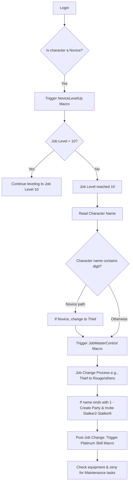

# Asgards Glory Botting & Openkore Automation

## Overview

This project automates character progression and in-game tasks on the Asgards Glory server. It leverages Openkore for automation and includes a series of macros to manage leveling, job changes, party formation, and NPC interactions. Key features include:
  
- **Botting Allowed:** Enjoy abstract automation via Openkore.
- **Character Progression:** Automated leveling from Novice to Stalker (via Thief, Rogue, High Thief).
- **Custom Quests & No P2W Features:** All items are farmable, with a variety of custom quests.
- **Automation & Macros:** From leveling (NoviceLevelUp) to job transitions (JobMasterControl) and party creation.
- **Integrated Logging:** Modified EXP output and automatic README table updates via Openkore log integration.

---

## Roadmap

| Status | Task |
|--------|------|
|  | **NoviceLevelUp:** Create a macro for leveling a novice character from 1/1 to Thief when below job level 10. Implement switch-case logic to determine if the character should change to Thief based on its name. |
|  | **JobMasterControl:** Upon reaching job level 10, read the character name (e.g., “Stalker3”) and trigger the appropriate job change process (Novice → Thief or Thief → Rouge, etc.). |
|  | **Party Creation Macro:** After the job change, if the character name ends with “1”, create a party (with EXP and item share) and invite Stalker2 to Stalker8. |
|  | **@autoloot & @go Commands:** Develop standalone automacros for @autoloot and implement @go both as standalone and integrated into other routines. |
|  | **Platinum Skill Macro:** After the job change, trigger a macro to interact with the Platinum Skill NPC for automatic skill addition. |
|  | **Maintenance Routine:** Create a maintenance macro that checks if a non-novice character is missing equipment (but has zeny) at certain levels (e.g., level 20) and purchases the necessary items. |
|  | **EXP Logging Update:** Modify Openkore's exp.txt output to include character names and average XP/hour data, and integrate these updates into the README table automatically. |
|  | **NPC Interaction Documentation:** Create detailed documentation for automacros interacting with NPCs (Healer, Skill Resetter, Stat Resetter, Job Changer, and Platinum Skill NPC). |
|  | **Job Change Automacro:** Create an automacro to change job at level 10 based on the character name. For example, Stalker1 will become Thief. |
|  | **Prontera Culvert Entrance Quest:** After job change, trigger a macro to complete the Prontera Culvert (Sewer) Entrance Quest and set the lockmap to Prontera Culvert F1 (prt_sewb1). |
|  | **Mr. Smile Creation:** Create a macro that will configure item control, farm materials from monsters, and create Mr. Smile. [Mr. Smile Quest](https://ratemyserver.net/quest_db.php?type=10000&qid=10001) at Geffen (119,107). |
|  | **Prontera Culvert Leveling:** Create a macro to set the leveling map to Prontera Culvert F1 until level 20 after the character is no longer a novice. The macro should auto-complete the [Prontera Culvert (Sewer) Entrance Quest](https://ratemyserver.net/quest_db.php?type=70000&qid=70006) and configure lockMap and mon control accordingly. |
|  | **SaveKafra Macro:** Create a macro to save at Kafra depending on the current map (e.g., Payon, Geffen, or Prontera). |
|  | **SaveTown Macro:** Create a macro to save the respawn map at Kafra depending on the current map (e.g., Payon, Geffen, or Prontera), configure SaveMap, and set up sellauto and storage NPCs. |
|  | **Equipment Purchase:** Create a macro to purchase and equip the following items based on zeny: |
|  | **Step 1: Upgrade to Main Gauche [3]**  **Condition:** When **zeny ≥ 2,400z** and **Knife [3]** is equipped.  **Action:** Buy and equip **Main Gauche [3]**.  **Vendor:** [Weapon Dealer (prt_in 172, 130)](https://ratemyserver.net/nsw_shop_search.php?sid=136&na=1).  **Damage Increase:** **17 → 43** (+152.94%). |
|  | **Step 2: Upgrade Basic Armor Set**  **Condition:** When **zeny ≥ 3,900z**, **Main Gauche [3]** is equipped, and **Cotton Shirt** is equipped.  **Action:** Buy and equip the following:  - **Guard [0]**  - **Sandals [0]**  - **Hood [0]**  - **Hat [0]**  - **Adventurer’s Suit [0]**  **Vendor:** [Armor Dealer (prt_in 172, 132)](https://ratemyserver.net/nsw_shop_search.php?sid=137&na=1). |
|  | **Step 3: Upgrade to Damascus [1]**  **Condition:** When **zeny ≥ 49,000z**, **Main Gauche [3]** is equipped, and **Adventurer’s Suit** is equipped.  **Action:** Buy and equip **Damascus [1]**.  **Vendor:** [Weapon Dealer (morocc_in 141, 67)](https://ratemyserver.net/nsw_shop_search.php?sid=105&na=1).  **Damage Increase:** **43 → 118** (+174.42%). |
|  | **Step 4: Equip Rosary Accessories**  **Condition:** When **zeny ≥ 30,000z**, **Damascus [1]** and **Adventurer’s Suit** are equipped.  **Action:** Buy and equip **2x Rosary [0]**.  **Vendor:** [Nun (prt_church 108, 124)](https://ratemyserver.net/nsw_shop_search.php?sid=132). |

---

## Macro Flow Diagram

Below is a simplified flow diagram outlining the macro interactions on login:

*This diagram represents the decision flow for macro interactions, including leveling, job change, party creation, and subsequent maintenance tasks.*

---

## Character Progression

The following table will be updated automatically with character stats via Openkore modifications and Git commits:

[Stalker1-8.md](https://github.com/nordichat/AsgardsGloryOpenkore/blob/feature/start/changelog/Stalker1-8.md)

*Each character’s progress and changelog are stored in separate markdown files (e.g., Stalker1.md) that can be auto-updated from Openkore logs.*

| Phase  | Level Range | Location                        | Equipment/Upgrade                                         | Stat Increase / Comparison            |
|--------|-------------|---------------------------------|-----------------------------------------------------------|---------------------------------------|
| Novice | 1-10        | Prontera Field (prt_fild06)     | Guard [1] (Shield), Jacket [1] (Body) upgraded with Pupa Card (Armor) | +2 DEF, +700 Max HP                  |
| Thief  | 10-25       | Prontera Culvert F1 (prt_sewb1) | Ribbon [1] (Upper Head), Falchion [4] (One-Handed Sword), Thief Bug Egg Card (Shield) | +1 DEF, +15 dmg, +400 Max HP         |
| Thief  | 25-30       | Prontera Culvert F2 (prt_sewb2) | Familiar Card (Weapon)                                    | +5 ATK                                |
| Thief  | 30-50       | Payon Cave 1 & 2 (pay_dun00, pay_dun01) | Blade [4] (One-Handed Sword), Hat [0] (Upper Head)        | +10 dmg, +1 DEF                       |
| Rogue  | 50-70       | Orc Dungeon 1 & 2 (gef_dun00, gef_dun01) | Composite Bow [4] (Weapon), Muffler [1] (Garment)         | +20 dmg, +5 DEF                       |
| Rogue  | 70-90       | Glast Heim St. Abbey & Chivalry 1 (gl_church, gl_knt01) | Cross Bow [3] (Weapon), Boots [1] (Footgear)              | +15 dmg, +3 DEF                       |
| Rogue  | 90-99       | Glast Heim Chivalry 2 (gl_knt02) | Chain Mail [1] (Body)                                     | +8 DEF                                |

---

## NPC Interaction

A dedicated section is maintained for NPC interactions, including:

- **Healer NPC:** Used when health is low.
- **Skill Resetter & Stat Resetter:** Triggered for stat or skill reallocation.
- **Job Changer NPC:** Managed by the JobMasterControl macro.
- **Platinum Skill NPC:** Activated post-job change to add the Platinum Skill automatically.

Each NPC interaction is documented with its own automacro and detailed logging.

---

## Additional Features & Integration

- **@autoloot & @go Commands:** Both have standalone automacros and are integrated into the overall automation routine.
- **Logging & README Integration:** Openkore’s exp.txt is modified to tag logs with character names and average XP/hour, with the data auto-updating the README table (or an external spreadsheet) via Git commits.
- **Visual Flow Diagrams & Detailed Documentation:** Visual aids (like the flow diagram above) are provided to map out the macro processes along with in-depth documentation for each automacro.

---

## ChatGPT Reference

This project documentation was developed in collaboration with ChatGPT using [this chat link](https://chatgpt.com/c/67cf6cb7-f0d0-8008-beb5-098a7cb72a17).  
*Keep this reference link saved for future updates and continued collaboration.*